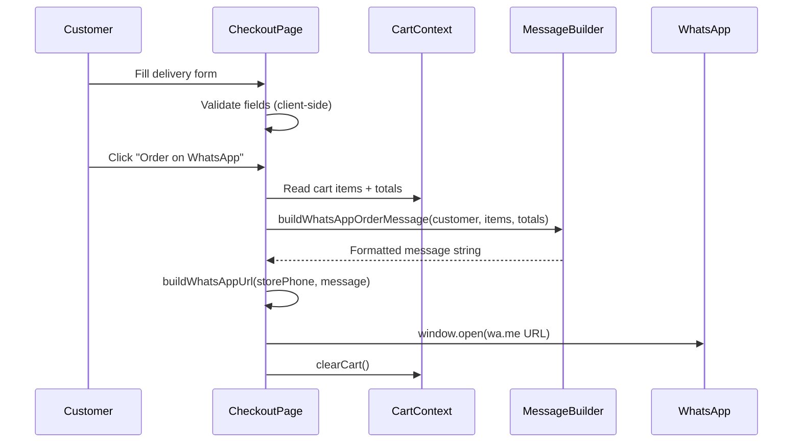

# Design Document: WhatsApp-Only Checkout

## Overview

This design converts the existing multi-payment e-commerce checkout (Razorpay, COD) into a WhatsApp-only ordering flow. The storefront removes all customer authentication, payment gateway integrations, and server-side order creation. Instead, customers fill a delivery details form and are redirected to WhatsApp with a pre-formatted order message containing all cart and customer information.

The admin panel remains untouched — admin authentication via Supabase and all admin management pages continue to function as before.

### Key Design Decisions

1. **Client-side only checkout**: No server-side order creation. The WhatsApp message IS the order. This eliminates backend payment processing complexity.
2. **No customer accounts**: All auth pages redirect to homepage. Cart remains in localStorage (already client-side).
3. **Pure function message builder**: The WhatsApp message construction is a pure function (`buildWhatsAppOrderMessage`) that takes customer details + cart items and returns a formatted string. This makes it highly testable.
4. **Phone normalization reuse**: The existing `normalizeWhatsAppPhone` utility already handles Indian phone format normalization — reuse it directly.

## Architecture

```mermaid
graph TB
    subgraph "Storefront (Client)"
        A[Product Pages] --> B[Cart - localStorage]
        B --> C[Checkout Page]
        C --> D[Checkout Form]
        D --> E[Form Validation]
        E --> F[WhatsApp Message Builder]
        F --> G[WhatsApp URL Constructor]
        G --> H[window.open - wa.me URL]
        H --> I[Cart Clear]
    end

    subgraph "Removed"
        X1[/api/razorpay/*]
        X2[/api/orders/create]
        X3[Customer Auth Pages]
        X4[Account Pages]
    end

    subgraph "Preserved"
        P1[Admin Panel /admin/*]
        P2[Admin Auth /admin/login]
        P3[Supabase DB - site_settings]
        P4[/api/coupons/apply]
    end

    C -->|fetch store phone| P3
    C -->|apply coupon| P4
    P2 --> P1

    style X1 fill:#ffcccc,stroke:#cc0000
    style X2 fill:#ffcccc,stroke:#cc0000
    style X3 fill:#ffcccc,stroke:#cc0000
    style X4 fill:#ffcccc,stroke:#cc0000
```

### Data Flow



## Components and Interfaces

### Modified Components

| Component | Change | Rationale |
|-----------|--------|-----------|
| `app/checkout/page.tsx` | Complete rewrite — remove Razorpay, COD, add WhatsApp-only form | Core feature change |
| `components/store/Header.tsx` | Remove `<HeaderAuth />` rendering | No customer auth |
| `components/store/MobileBottomNav.tsx` | Replace "Account" nav item with "Checkout" link | Account pages removed |
| `components/store/Footer.tsx` | Remove "My account", "Track order", "Wishlist" links | Account pages removed |
| `utils/store/whatsapp.ts` | Add `buildWhatsAppOrderMessage` function | New message format with customer details |

### Removed Components/Routes

| Path | Reason |
|------|--------|
| `app/auth/*` | Customer auth removed — redirect to homepage |
| `app/account/*` | Account pages removed — redirect to homepage |
| `app/api/razorpay/*` | Payment gateway removed |
| `app/api/orders/create/route.ts` | Server-side order creation removed |
| `components/store/HeaderAuth.tsx` | No longer rendered (can be deleted or left unused) |
| `components/store/AccountDropdown.tsx` | No longer rendered |
| `context/StoreUserProvider.tsx` | No customer auth context needed |

### Preserved Components

| Path | Status |
|------|--------|
| `app/admin/*` | Unchanged |
| `app/(public-admin)/admin/login/*` | Unchanged |
| `app/api/admin/*` | Unchanged |
| `app/api/coupons/apply/route.ts` | Unchanged — used by checkout |
| `app/api/invoices/*` | Unchanged — used by admin |
| `context/CartContext.tsx` | Unchanged — still used for client-side cart |

### New/Updated Interfaces

```typescript
// Input to the WhatsApp message builder
type WhatsAppOrderData = {
  customer: {
    name: string;          // required, max 100 chars
    phone: string;         // required, 10-digit Indian mobile
    email?: string;        // optional, valid email format
    alternatePhone?: string; // optional, 10-digit Indian mobile
    addressLine: string;   // required, max 250 chars
    city?: string;
    state?: string;
    pincode?: string;      // optional, 6-digit numeric
    landmark?: string;
  };
  items: CartItem[];       // from existing CartItem type
  subtotal: number;        // cart total before discount
  discount: number;        // applied discount amount (0 if none)
  total: number;           // final payable = subtotal - discount
};

// Validation result for the checkout form
type FormValidation = {
  isValid: boolean;
  errors: Record<string, string>; // field name → error message
};
```

## Data Models

### Existing Models (Unchanged)

- **CartItem** (`types/index.ts`): `{ id, name, image_url, sell_price, mrp_price, qty, slug, selected_options? }`
- **SiteSettings** (`types/index.ts`): Contains `whatsapp: string` — the Store_Phone
- **Order** (`types/index.ts`): Existing orders in DB retain all fields (payment_method, razorpay_* fields) for historical data

### Form State Model

```typescript
// Client-side form state in checkout page
type CheckoutFormState = {
  // Required
  name: string;
  phone: string;
  addressLine: string;
  // Optional
  email: string;
  alternatePhone: string;
  city: string;
  state: string;
  pincode: string;
  landmark: string;
};
```

### Validation Rules

| Field | Required | Rule |
|-------|----------|------|
| name | Yes | Non-empty, non-whitespace-only, max 100 chars |
| phone | Yes | Exactly 10 digits (Indian mobile) |
| addressLine | Yes | Non-empty, non-whitespace-only, max 250 chars |
| email | No | Valid email format (regex) if provided |
| alternatePhone | No | 10 digits (Indian mobile) if provided |
| city | No | No validation |
| state | No | No validation |
| pincode | No | Exactly 6 digits if provided |
| landmark | No | No validation |

### Redirect Logic

The auth/account route redirects are implemented via Next.js middleware or page-level redirects:

```typescript
// app/auth/[...path]/page.tsx — redirect all auth routes
import { redirect } from "next/navigation";
export default function AuthRedirect() {
  redirect("/");
}

// app/account/[...path]/page.tsx — redirect all account routes
import { redirect } from "next/navigation";
export default function AccountRedirect() {
  redirect("/");
}
```

## Correctness Properties

*A property is a characteristic or behavior that should hold true across all valid executions of a system — essentially, a formal statement about what the system should do. Properties serve as the bridge between human-readable specifications and machine-verifiable correctness guarantees.*

### Property 1: Form field validation correctly accepts and rejects inputs

*For any* string input to a required field (name, phone, addressLine), the validation function SHALL return invalid if and only if the string is empty, contains only whitespace, exceeds the maximum length (100 for name, 250 for address), or fails format constraints (10 digits for phone). For optional fields with format constraints (email, pincode, alternatePhone), the validation function SHALL return invalid if and only if the field is non-empty AND fails its format constraint.

**Validates: Requirements 3.1, 3.2, 3.5**

### Property 2: Cart summary rendering contains all item information

*For any* non-empty array of CartItem objects, the rendered cart summary SHALL contain each item's name, quantity (as a number), unit sell_price formatted as INR with ₹ symbol, and line total (qty × sell_price) formatted as INR with ₹ symbol.

**Validates: Requirements 3.3**

### Property 3: Order total computation is correct

*For any* non-negative subtotal and non-negative discount where discount ≤ subtotal, the displayed final total SHALL equal subtotal minus discount. When discount is 0, the final total SHALL equal the subtotal.

**Validates: Requirements 3.4**

### Property 4: WhatsApp message Customer Details section completeness

*For any* customer data object with a name, phone, and addressLine, the built message SHALL contain all three values in a "Customer Details" section. Additionally, *for any* non-empty optional field (email, alternatePhone, city, state, pincode, landmark), that value SHALL appear in the Customer Details section. Conversely, *for any* empty optional field, its label SHALL NOT appear in the message.

**Validates: Requirements 4.1, 4.5, 4.6, 4.8**

### Property 5: WhatsApp message Order Items formatting

*For any* array of cart items where each item has a name, quantity, and sell_price, the built message SHALL contain one line per item in an "Order Items" section, where each line includes the product name, quantity, unit price formatted with ₹ symbol, and line total (qty × sell_price) formatted with ₹ symbol.

**Validates: Requirements 4.2**

### Property 6: WhatsApp message Order Total correctness

*For any* order with subtotal and discount values: if discount > 0, the message "Order Total" section SHALL include the subtotal, discount amount, and final payable total (subtotal - discount), all formatted with ₹ symbol. If discount equals 0, the "Order Total" section SHALL include only the subtotal as the payable total without a discount line.

**Validates: Requirements 4.3, 4.4**

### Property 7: WhatsApp message structure and formatting

*For any* valid order data, the built message SHALL contain exactly three labeled section headers ("Customer Details", "Order Items", "Order Total"), each separated by at least one blank line. The "Order Items" section SHALL have exactly one line per cart item.

**Validates: Requirements 4.7**

### Property 8: WhatsApp URL construction with phone normalization

*For any* raw phone string that represents a valid Indian mobile number (10 digits, 11 digits starting with 0, or 12 digits starting with 91), the constructed WhatsApp URL SHALL be `https://wa.me/91XXXXXXXXXX?text={encoded}` where the phone is normalized to 12-digit format and the message is URL-encoded using `encodeURIComponent`.

**Validates: Requirements 5.1, 5.2**

## Error Handling

### Form Validation Errors

| Scenario | Behavior |
|----------|----------|
| Required field empty/whitespace | Inline error message below field, "Order on WhatsApp" button disabled |
| Phone number not 10 digits | Inline error: "Enter a valid 10-digit mobile number" |
| Name exceeds 100 chars | Inline error: "Name must be 100 characters or less" |
| Address exceeds 250 chars | Inline error: "Address must be 250 characters or less" |
| Optional email invalid format | Inline error: "Enter a valid email address" |
| Optional pincode not 6 digits | Inline error: "Enter a valid 6-digit pincode" |

### Cart/Configuration Errors

| Scenario | Behavior |
|----------|----------|
| Cart is empty | "Order on WhatsApp" button disabled, message: "Add at least one product" |
| Store phone not configured | "Order on WhatsApp" button disabled, message: "WhatsApp ordering is currently unavailable" |
| Store phone invalid format | Same as not configured — button disabled |
| Coupon API failure | Display error message from API response, no crash |

### Navigation Errors

| Scenario | Behavior |
|----------|----------|
| Visit `/auth/*` routes | HTTP 307 redirect to `/` |
| Visit `/account/*` routes | HTTP 307 redirect to `/` |
| Visit removed API routes | HTTP 404 with JSON `{ "error": "Route not found" }` |

## Testing Strategy

### Unit Tests (Example-Based)

- **Redirect behavior**: Verify each auth/account route returns 307
- **UI removal**: Header, Footer, MobileBottomNav render without auth links
- **Checkout UI**: No Razorpay script, no payment method selector
- **Edge cases**: Empty cart disables button, missing store phone disables button
- **Cart clear after submit**: Cart is emptied after WhatsApp URL opens

### Property-Based Tests

Property-based testing is appropriate for this feature because the core logic (form validation, message building, URL construction, phone normalization) consists of pure functions with clear input/output behavior and a large input space.

**Library**: [fast-check](https://github.com/dubzzz/fast-check) (TypeScript PBT library, already compatible with the project's Jest/Vitest setup)

**Configuration**:
- Minimum 100 iterations per property test
- Each test references its design document property via tag comment

**Property tests to implement**:

1. **Feature: whatsapp-only-checkout, Property 1: Form field validation** — Generate random strings (valid names, whitespace-only, over-length, valid/invalid phones, valid/invalid emails, valid/invalid pincodes) and verify validation results.

2. **Feature: whatsapp-only-checkout, Property 2: Cart summary rendering** — Generate random CartItem arrays and verify rendered output includes all required fields per item.

3. **Feature: whatsapp-only-checkout, Property 3: Order total computation** — Generate random subtotal/discount pairs and verify `total === subtotal - discount`.

4. **Feature: whatsapp-only-checkout, Property 4: Customer Details completeness** — Generate random customer objects with varying optional fields filled/empty, verify message includes all non-empty fields and excludes empty ones.

5. **Feature: whatsapp-only-checkout, Property 5: Order Items formatting** — Generate random CartItem arrays and verify each item appears as a correctly formatted line in the message.

6. **Feature: whatsapp-only-checkout, Property 6: Order Total correctness** — Generate random subtotal/discount combinations (with and without discount) and verify correct section content.

7. **Feature: whatsapp-only-checkout, Property 7: Message structure** — Generate random valid order data and verify section headers, blank line separators, and item count.

8. **Feature: whatsapp-only-checkout, Property 8: URL construction** — Generate random valid Indian phone numbers in various formats and random message strings, verify URL format and encoding.

### Integration Tests

- **Admin login flow**: Valid admin credentials → redirect to `/admin`
- **Admin order display**: Historical Razorpay orders render correctly
- **Coupon application**: Coupon API returns correct discount
- **Site settings fetch**: Store phone is correctly loaded from `site_settings`
